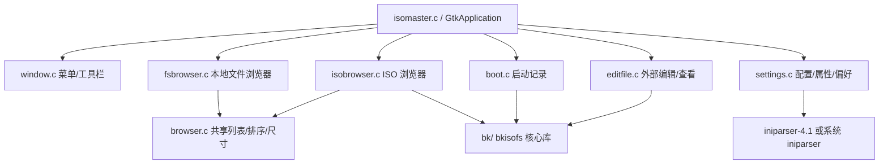
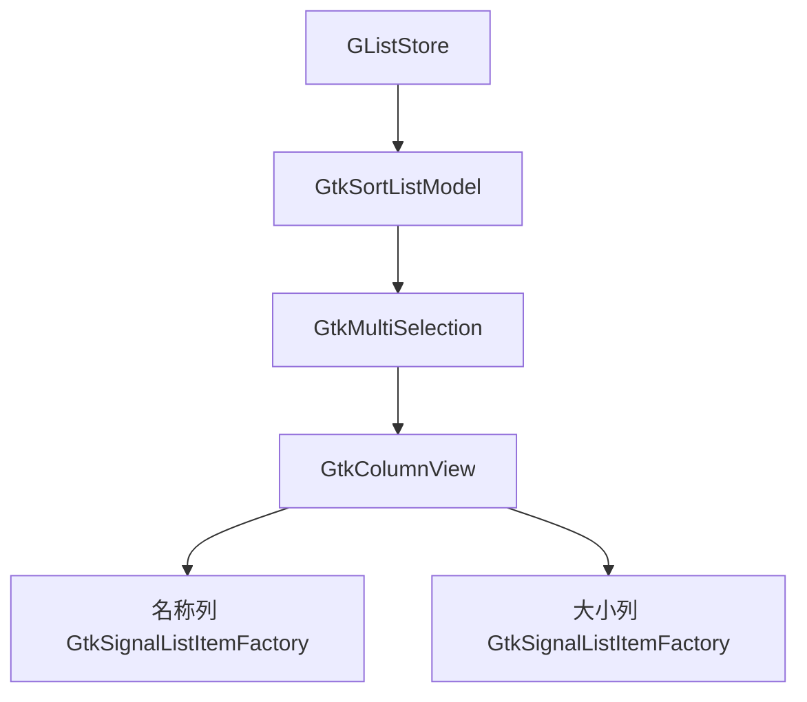
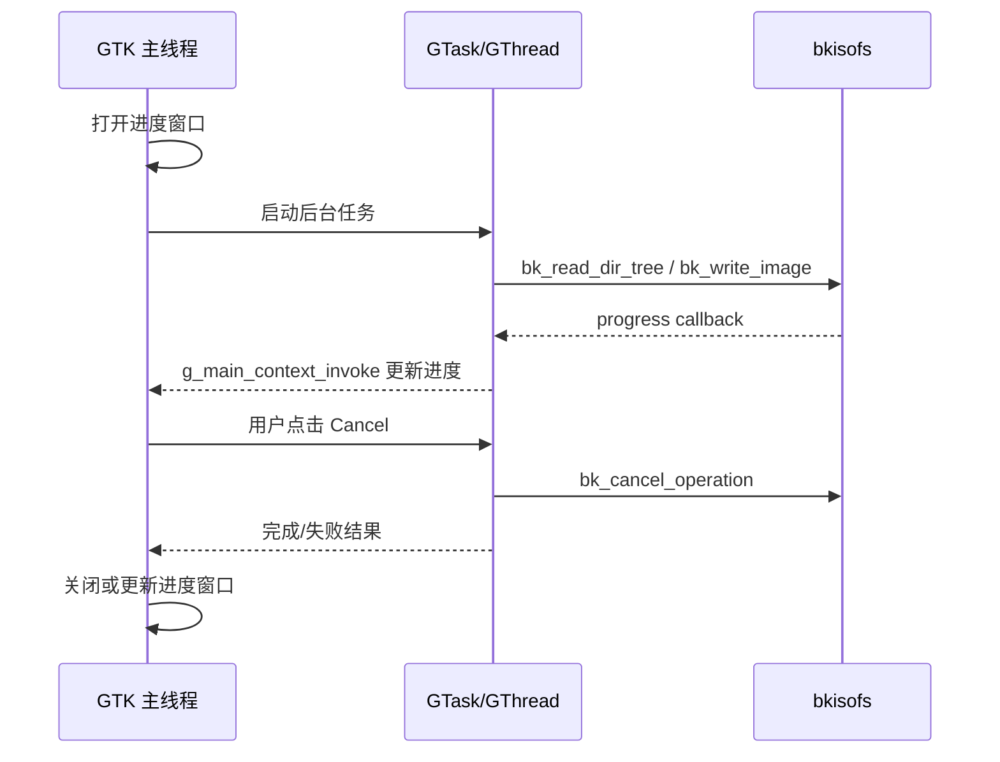

# ISO Master GTK4 + Wayland 完整迁移计划

生成日期：2026-06-22

## 1. 目标与范围

### 目标

将当前 GTK2 版 ISO Master 完整迁移到 GTK4，并确保在 Wayland 会话下原生可用。

最终交付应满足：

- 使用 `gtk4` 开发包构建，不再依赖 `gtk+-2.0`。
- 应用生命周期迁移到 `GtkApplication` / `GApplication`。
- 菜单、工具栏、列表视图、对话框、文件选择、事件处理全部使用 GTK4 API。
- 在 Wayland 后端运行：`GDK_BACKEND=wayland ./isomaster`。
- 保留现有业务能力：打开 ISO/NRG/MDF、浏览本地文件系统、浏览 ISO、添加/删除/提取/重命名/编辑文件、设置启动镜像、保存 ISO、偏好设置、最近打开列表、国际化。
- `bk/` 核心 ISO 读写库保持 GUI 无关，尽量不改变其行为。

### 非目标

- 不重写 bkisofs 核心算法。
- 不改变 ISO 写入格式、错误码、配置语义，除非为 GTK4/Wayland 兼容必须调整。
- 不在同一进程同时链接 GTK2 与 GTK4；迁移应在独立分支完成。

## 2. 当前代码评估摘要

### 2.1 代码规模

当前顶层 GUI/配置层约 **6,363 行 C/H**：

| 模块 | 行数 | 职责 | GTK4 迁移风险 |
|---|---:|---|---|
| `isomaster.c` + `isomaster.h` | 172 | 入口、主窗口布局、初始化 | 高 |
| `window.c` + `window.h` | 513 | 菜单、工具栏、窗口关闭、图标 | 高 |
| `browser.c` + `browser.h` | 369 | FS/ISO 共享模型、排序、尺寸显示 | 高 |
| `fsbrowser.c` + `fsbrowser.h` | 631 | 本地文件系统浏览器 | 高 |
| `isobrowser.c` + `isobrowser.h` | 2,027 | ISO 浏览、打开/保存、增删改提取、进度 | 最高 |
| `settings.c` + `settings.h` | 976 | 配置读写、属性/偏好对话框 | 中高 |
| `boot.c` + `boot.h` | 407 | 启动记录对话框/操作 | 中 |
| `editfile.c` + `editfile.h` | 816 | 外部编辑器/查看器、临时文件 | 中 |
| `about.c` + `about.h` | 420 | 关于窗口、帮助窗口 | 低中 |
| `error.c` + `error.h` | 32 | 错误字符串 | 低 |

`bk/` 核心库约 **8,383 行**，搜索未发现 `gtk`/`gdk` 依赖，可视为迁移边界外的稳定核心。

### 2.2 依赖关系



关键结论：

- **GTK 迁移集中在顶层 GUI 层**，`bk/` 可保持纯 C。
- 最大风险来自 `GtkTreeView`/`GtkListStore`/`GtkCellRenderer` 列表浏览器、同步阻塞对话框、GTK2 菜单/工具栏和事件信号。
- 现有代码大量依赖全局 `GtkWidget*` 与同步控制流，迁移时需要建立小型 UI 适配层，避免一次性大改所有业务回调。

### 2.3 本机依赖状态

已检查当前环境：

- `pkg-config --modversion gtk4` 返回 `4.22.4`。
- `pkg-config --modversion gtk+-2.0 gtk4` 因 `gtk+-2.0` 缺失失败。

这说明当前环境适合开始 GTK4 迁移验证，但无法直接构建原始 GTK2 版本作为本机基线；如需基线测试，需要安装 GTK2 开发包或使用容器。

## 3. GTK2 API 使用与 GTK4 替换清单

### 3.1 主要旧 API 计数

基于源码扫描，GTK2 相关高频 API 包括：

| API/模式 | 出现次数 | 影响 |
|---|---:|---|
| `gtk_dialog_run` | 61 | GTK4 移除同步运行模式，需要响应回调或本地 `GMainLoop` 过渡层 |
| `gtk_widget_show` / `gtk_widget_show_all` | 124+ | GTK4 显示模型变化，应使用 `gtk_window_present()`、`gtk_widget_set_visible()` 或默认可见子控件 |
| `gtk_widget_destroy` | 71 | GTK4 推荐 `gtk_window_destroy()` / 生命周期管理 |
| `gtk_box_pack_start` | 38 | GTK4 改为 `gtk_box_append()`/`gtk_box_prepend()` + expand/align 属性 |
| `gtk_menu*` / `GtkMenuItem` / `GtkImageMenuItem` | 86+ | GTK4 移除传统菜单，改为 `GMenuModel` + `GtkPopoverMenuBar`/`GtkPopoverMenu` + `GAction` |
| `gtk_toolbar*` | 11 | GTK4 移除传统工具栏，改为 `GtkBox`/`GtkButton`/`GtkHeaderBar` |
| `GTK_STOCK_*` | 多处 | GTK4 移除 stock item，改为主题 icon name 或内置 PNG 资源 |
| `GtkTreeView` / `GtkListStore` / `GtkCellRenderer` | 多处 | GTK4 中旧 tree/list 栈已不推荐；最终建议迁移到 `GtkColumnView` + `GListStore` |
| `GtkTable` | 多处 | GTK4 移除，改为 `GtkGrid` |
| `GTK_DIALOG(dialog)->vbox` | 24 | GTK4 不允许直接访问结构体字段，改为 `gtk_dialog_get_content_area()` |
| `gtk_bin_get_child` / `GTK_BIN` | 11 | GTK4 移除，菜单项/标签需改为 action/model 数据管理 |
| `button-press-event` / `button-release-event` / `key-press-event` | 多处 | GTK4 改为 `GtkGestureClick`、`GtkEventControllerKey`、`GtkShortcutController` |
| `gtk_main` / `gtk_main_quit` / `gtk_events_pending` / `gtk_main_iteration` | 多处 | GTK4 应使用 `g_application_run()` 和异步任务/主上下文投递 |
| `GtkFileChooserDialog` / `GtkFileChooserButton` | 多处 | 推荐 `GtkFileDialog` 或 `GtkFileChooserNative`，Wayland 下使用门户更自然 |

### 3.2 建议替换表

| 现有 GTK2 写法 | GTK4 目标写法 |
|---|---|
| `gtk_init()` + `gtk_main()` | `GtkApplication` + `g_application_run()` |
| `gtk_window_new(GTK_WINDOW_TOPLEVEL)` | `gtk_application_window_new(app)` |
| `gtk_container_add()` | `gtk_window_set_child()`、`gtk_frame_set_child()`、`gtk_scrolled_window_set_child()` 等容器专用 API |
| `gtk_vbox_new()` / `gtk_hbox_new()` | `gtk_box_new(GTK_ORIENTATION_VERTICAL/HORIZONTAL, spacing)` |
| `gtk_vpaned_new()` | `gtk_paned_new(GTK_ORIENTATION_VERTICAL)` |
| `gtk_box_pack_start()` | `gtk_box_append()` + `gtk_widget_set_hexpand/vexpand()` |
| `GtkMenuBar` / `GtkMenu` | `GMenu` + `GtkPopoverMenuBar` / `GtkPopoverMenu` |
| `gtk_accel_group_*` | `GAction` + `gtk_application_set_accels_for_action()` |
| `GtkToolbar` | 自定义 `GtkBox` 工具条 + `GtkButton` / `GtkImage` |
| `GTK_STOCK_OPEN` 等 | icon name：`document-open-symbolic`、`document-save-symbolic`、`go-up-symbolic` 等 |
| `GtkTreeView`/`GtkListStore` | `GtkColumnView` + `GListStore` + `GtkSortListModel` + `GtkMultiSelection` |
| `GtkCellRenderer` | `GtkSignalListItemFactory` |
| `GtkTreeSelection` | `GtkSelectionModel` / `GtkMultiSelection` |
| `GtkTable` | `GtkGrid` |
| `gtk_misc_set_alignment()` | `gtk_label_set_xalign()`、`gtk_widget_set_halign()` |
| `gtk_dialog_run()` | 响应信号 + 回调；过渡期可封装本地 `GMainLoop` |
| `GTK_DIALOG(dialog)->vbox` | `gtk_dialog_get_content_area()` |
| `gtk_file_chooser_dialog_new()` | `GtkFileDialog`；若需兼容 GTK4 < 4.10，使用 `GtkFileChooserNative` |
| `GtkFileChooserButton` | `GtkButton` + `GtkFileDialog` 选择目录 |
| `button-press-event` | `GtkGestureClick` |
| `key-press-event` | `GtkEventControllerKey` 或 `GtkShortcutController` |
| `gtk_menu_popup()` | `GtkPopoverMenu` + `gtk_popover_popup()` |
| `gtk_window_set_icon(GdkPixbuf*)` | 安装 app icon 到 icon theme，设置 application id；Wayland 下 app id 与 desktop 文件匹配 |
| `gtk_widget_render_icon()` / `GtkIconFactory` | 主题 icon name、`GIcon`、`GdkTexture` 或资源文件 |

## 4. 目标 GTK4/Wayland 架构

### 4.1 应用生命周期

引入应用级上下文结构，逐步替代分散全局变量：

```c
typedef struct {
    GtkApplication *app;
    GtkWidget *main_window;
    GtkWidget *browser_paned;
    GtkWidget *fs_view;
    GtkWidget *iso_view;
    GListStore *fs_store;
    GListStore *iso_store;
    AppSettings settings;
    VolInfo vol_info;
    bool iso_pane_active;
    bool iso_changes_probable;
} IsoMasterApp;
```

迁移早期可以继续保留部分全局变量，但应让新代码通过 `IsoMasterApp` 传递状态，最终降低回调之间的隐式耦合。

### 4.2 浏览器数据模型

当前两个浏览器都使用同一列模型：

- `COLUMN_ICON`
- `COLUMN_FILENAME`
- `COLUMN_SIZE`
- `COLUMN_HIDDEN_TYPE`

GTK4 目标模型建议定义 `IsoMasterFileItem` GObject：

| 属性 | 类型 | 来源 |
|---|---|---|
| `name` | string | 文件名/ISO 条目名 |
| `size` | `guint64` | 本地文件或 ISO 文件大小 |
| `file_type` | enum | regular / directory / symlink |
| `icon_name` | string | `folder-symbolic` / `text-x-generic-symbolic` 等 |
| `full_path` | string，可选 | 用于简化回调，减少重复拼接 |

每个浏览器使用：



排序策略：

- `sortDirectoriesFirst`：目录优先。
- `caseSensitiveSort`：大小写敏感/不敏感字符串比较。
- 名称列和尺寸列都实现 `GtkCustomSorter`。
- 写回配置时存储逻辑列名或枚举，而不是 GTK2 的 sort column id。

### 4.3 菜单、快捷键和动作

将所有命令统一成 `GAction`：

| 动作 | 原回调 | 快捷键 |
|---|---|---|
| `app.new` | `newIsoCbk` | `<Control>N` |
| `app.open` | `openIsoCbk` | `<Control>O` |
| `app.save-as` | `saveIsoCbk` | `<Control>S` |
| `app.quit` | `closeMainWindowCbk` | `<Control>Q`, `<Control>W` |
| `app.refresh` | `refreshBothViewsCbk` | `F5` |
| `app.rename` | `renameSelectedBtnCbk` | `F2` |
| `app.view` | `viewSelectedBtnCbk` | `F3` |
| `app.edit` | `editSelectedBtnCbk` | `F4` |
| `app.delete` | `deleteSelectedFromIso` | `Delete` |
| `app.preferences` | `showPreferencesWindowCbk` | 可选 |
| `app.about` | `showAboutWindowCbk` | 可选 |

主菜单使用 `GMenu` 构造，再绑定到 `GtkPopoverMenuBar`。右键菜单使用 `GtkPopoverMenu`，根据当前选择数量动态启用/禁用动作。

### 4.4 Wayland 支持设计

GTK4 默认支持 Wayland，代码侧重点是避免 X11 依赖和使用 GTK4 推荐的门户/弹出层机制。

要求：

1. 使用 `GtkApplication` application id，例如 `org.littlesvr.ISOMaster`。
2. desktop 文件名和 app id 对齐，例如 `org.littlesvr.ISOMaster.desktop`。
3. 应用图标安装到 icon theme，例如：
   - `share/icons/hicolor/256x256/apps/org.littlesvr.ISOMaster.png`
4. 文件选择优先使用 `GtkFileDialog`，以便 Wayland/Flatpak/portal 场景更自然。
5. 右键菜单使用 `GtkPopoverMenu` 并锚定到控件/行区域，不依赖全局坐标。
6. 不使用 X11 专属 API、窗口位置控制或全局输入抓取。
7. 外部编辑器/查看器使用 `g_spawn_async()` 或 `GSubprocess` 启动，继承 `WAYLAND_DISPLAY`、`XDG_CURRENT_DESKTOP` 等环境。

## 5. 分阶段迁移计划

由于 GTK2 和 GTK4 不能在同一进程共存，建议采用 **源代码层面的分支迁移 + 适配层降低风险**：创建 `gtk4-wayland` 分支，按模块拆分，每个阶段都保持可编译或接近可编译。

### Phase 0：基线、安全网与迁移准备

**目标**：迁移前固定现有行为，避免 GTK 改造时误改 ISO 逻辑。

任务：

1. 建立迁移分支：`gtk4-wayland`。
2. 记录当前构建依赖：GTK2、gettext、iniparser、gcc/make。
3. 如果需要原始基线，准备容器或安装 GTK2 dev 包，运行 `make`。
4. 为 `bk/` 增加或整理最小行为测试：
   - 新建 ISO 卷信息。
   - 读取小型 ISO。
   - 添加目录/文件。
   - 提取并用 `compare-dir-trees.sh` 比对。
   - 保存后重新打开。
5. 准备 UI 手工回归清单：菜单、快捷键、右键菜单、文件选择、进度取消、编辑/查看、启动记录。
6. 捕获当前配置文件 `~/.isomaster` 的读写字段，确保迁移后兼容。

验证：

- `bk/` 测试在未迁移代码上通过。
- 手工记录至少一套 ISO 操作流程。

回滚：

- 仅在新分支操作；任何失败均回到原分支或 revert Phase 0 提交。

### Phase 1：构建系统与 GTK4 应用骨架

**目标**：让项目以 GTK4 方式启动一个空主窗口，为后续模块接入打基础。

任务：

1. `Makefile`：
   - `pkg-config --cflags gtk+-2.0` → `pkg-config --cflags gtk4`
   - `pkg-config --libs gtk+-2.0` → `pkg-config --libs gtk4`
   - 如使用 `GSubprocess`/`GResource`，确认 `gio-2.0` 已由 gtk4 间接提供或显式加入。
2. 新增/调整应用入口：
   - `main()` 创建 `GtkApplication`。
   - `activate` 回调创建 `GtkApplicationWindow`。
   - `g_application_run()` 替代 `gtk_main()`。
3. 保留 gettext 初始化、设置加载、信号/临时文件清理逻辑。
4. 替换主布局：
   - `gtk_vbox_new` → `gtk_box_new(GTK_ORIENTATION_VERTICAL, 0)`。
   - `gtk_container_add(GBLmainWindow, mainVBox)` → `gtk_window_set_child()`。
   - `gtk_vpaned_new` → `gtk_paned_new(GTK_ORIENTATION_VERTICAL)`。
   - `gtk_frame_set_child()` / `gtk_paned_set_start_child()` / `gtk_paned_set_end_child()`。
5. 替换窗口关闭：
   - `delete_event` → `close-request`。
   - `gtk_main_quit()` → `g_application_quit()`。

验证：

- `make` 可进入 GTK4 编译阶段。
- `GDK_BACKEND=wayland ./isomaster` 能显示主窗口框架。
- `GDK_BACKEND=x11 ./isomaster` 可选验证兼容。

回滚：

- 回滚 `Makefile`、`isomaster.c`、`window.c` 中应用入口相关提交。

### Phase 2：菜单、工具栏、动作与快捷键

**目标**：替换 GTK2 菜单/工具栏/accelerator，保留所有用户可见命令入口。

任务：

1. 新增 `actions.c/.h` 或在 `window.c` 中集中定义 `GActionEntry`。
2. 将命令映射为 `GAction`，回调内部可暂时调用旧函数。
3. 主菜单：
   - 使用 `GMenu` 构造 File/View/Tools/Help。
   - 使用 `GtkPopoverMenuBar` 显示。
4. 最近打开：
   - 当前代码保存 `GtkWidget* GBLrecentlyOpenWidgets[5]` 并通过 `gtk_bin_get_child()` 读写标签。
   - GTK4 下改为数据数组 + 动态 `GMenu`，动作参数传递文件路径。
5. 右键菜单：
   - FS 浏览器：View/Edit。
   - ISO 浏览器：Rename/View/Edit/Change permissions。
   - 使用 `GtkPopoverMenu` 和动作启用状态替代 `gtk_menu_popup()`。
6. 工具栏：
   - `GtkToolbar` → `GtkBox`。
   - 每个工具按钮使用 `GtkButton` + `GtkImage` + tooltip。
   - ISO size label 放入同一水平 box。
7. 快捷键：
   - `gtk_application_set_accels_for_action()` 替代 `GtkAccelGroup`。

验证：

- 所有菜单项可触发旧回调或临时 stub。
- `Ctrl+N/O/S/Q/W`、`F1-F5`、`Delete` 行为可触发。
- 右键菜单在 Wayland 下出现且锚定正确。

回滚：

- 保留旧回调函数；若动作层失败，只回滚 `window.c`/`actions.c`，不影响 `bk/`。

### Phase 3：浏览器列表模型迁移

**目标**：迁移本地文件系统和 ISO 文件列表，这是整个项目的核心 UI 改造。

任务：

1. 新增 `file_item.c/.h`：定义 `IsoMasterFileItem` GObject。
2. 新增 `browser_model.c/.h`：
   - 创建 `GListStore`。
   - 提供 `browser_store_clear()`、`browser_store_append_file()`。
   - 提供排序器：名称、大小、目录优先、大小写敏感配置。
   - 提供选中项遍历工具，替代 `gtk_tree_selection_selected_foreach()`。
3. `browser.c`：
   - `formatSize()` 可保留。
   - `sizeCellDataFunc32/64` 替换为 column factory 的 label bind 函数。
   - `sortByName/sortBySize` 改为 `GtkSorter` 回调。
4. `fsbrowser.c`：
   - `GtkTreeView` → `GtkColumnView`。
   - `GtkListStore` → `GListStore`。
   - `GtkScrolledWindow` child 设置为 ColumnView。
   - `row-activated` → `GtkColumnView::activate`。
   - 右键处理用 `GtkGestureClick`。
   - `refreshFsView()` 保存/恢复滚动位置改用 `GtkAdjustment` 或 `GtkScrollable`。
5. `isobrowser.c`：
   - 同步迁移 ISO 列表。
   - `changeIsoDirectory()` 中填充 `GListStore`。
   - 所有 `GtkTreeModel/GtkTreeIter/GtkTreePath` 回调改为基于 `IsoMasterFileItem*`。
6. 多选行为：
   - 使用 `GtkMultiSelection`。
   - 右键已选中行时不破坏当前多选；右键未选中行时可选择该行再弹出菜单。
7. 图标：
   - 模型中存储 `icon_name`，factory 用 `gtk_image_set_from_icon_name()`。
   - 可优先使用主题图标，内置 PNG 作为 fallback。

验证：

- 本地目录可浏览、隐藏文件开关有效、目录优先排序有效、大小写排序有效。
- ISO 根目录和子目录可浏览。
- 多选、双击进入目录、返回上级目录都正常。
- 选中项操作传入的文件名与旧代码一致。

回滚：

- 将浏览器迁移拆成 FS 和 ISO 两个独立提交；失败时回滚对应模块。
- `bk/` 不变，因此 ISO 数据可用性不受影响。

### Phase 4：对话框与文件选择迁移

**目标**：消除 `gtk_dialog_run`、`GTK_DIALOG(...)->vbox`、`GtkFileChooserDialog/Button` 等 GTK2 模式。

任务：

1. 新增 `ui_dialogs.c/.h`：
   - `show_error(parent, format, ...)`
   - `show_warning_continue(parent, message, callback)`
   - `confirm_discard_changes(parent, callback)`
   - `prompt_text(parent, title, initial, max_len, callback)`
2. 过渡策略：
   - 若短期需要最小改造，可实现 `im_dialog_run_blocking()`，内部用本地 `GMainLoop` 等待 `response`。
   - 最终目标仍是全部异步回调，避免长时间嵌套主循环。
3. 替换所有 `GTK_DIALOG(dialog)->vbox`：
   - `GtkWidget *content = gtk_dialog_get_content_area(GTK_DIALOG(dialog));`
   - `gtk_box_append(GTK_BOX(content), child);`
4. `GtkTable` → `GtkGrid`：
   - `settings.c` 的 Image Information。
   - `isobrowser.c` 的 permissions 对话框。
5. 文件打开/保存：
   - `openIsoCbk()` 使用 `GtkFileDialog` + `GtkFileFilter`。
   - `saveIsoCbk()` 使用 `GtkFileDialog`。
   - 自动补 `.iso` 逻辑保留；如需要 checkbox，可迁移到偏好设置或保存前自定义确认对话框。
6. 启动记录文件选择：
   - `boot.c` 的 open/save 改为 `GtkFileDialog`。
7. 偏好设置临时目录选择：
   - `GtkFileChooserButton` → `GtkButton` + label + `GtkFileDialog` select folder。
8. About/Help：
   - `gtk_show_about_dialog()` 可继续使用 GTK4 属性。
   - Help 窗口使用 `GtkWindow` + `GtkLabel`/`GtkScrolledWindow`。

验证：

- 所有错误/确认/输入对话框能正常显示和关闭。
- 文件打开/保存/目录选择在 Wayland 下调用门户或原生文件选择器。
- 保存自动补扩展行为保持。
- 偏好设置保存后 `~/.isomaster` 字段兼容。

回滚：

- `ui_dialogs` 作为单独适配层；某个对话框迁移失败时只回滚该调用点。

### Phase 5：长耗时操作、进度与取消

**目标**：替换 GTK2 风格的 `gtk_events_pending()/gtk_main_iteration()` 进度刷新，避免阻塞 GTK4 主线程。

当前高风险点：

- `activityProgressUpdaterCbk()` 中手动 `gtk_main_iteration()`。
- `writingProgressUpdaterCbk()` 中手动 `gtk_main_iteration()`。
- `openIso()`、`addToIsoCbk()`、`extractFromIsoCbk()`、`saveIso()` 直接在主线程执行可能很慢的 `bk_*` 操作。

目标设计：



任务：

1. 新增 `operations.c/.h`：封装 open/read/add/extract/save 操作。
2. 使用 `GTask` 或 `GThreadPool` 在后台执行 `bk_*`。
3. 进度回调不直接操作 GTK widget，改为投递到主线程。
4. Cancel 按钮调用 `bk_cancel_operation()`。
5. 操作完成后统一刷新 FS/ISO 视图和 ISO size label。
6. 统一错误路径和进度窗口销毁路径，避免 dangling widget 指针。

验证：

- 打开大 ISO 时窗口不冻结。
- 添加/提取/保存期间进度条更新。
- Cancel 可取消并恢复 UI 状态。
- 操作失败错误信息准确。

回滚：

- 保留旧同步函数作为参考；每个操作单独迁移，出现问题只回滚对应 operation wrapper。

### Phase 6：外部编辑器/查看器迁移与清理

**目标**：使外部编辑/查看更符合 GLib/GTK4/Wayland 运行方式。

任务：

1. `fork()` + `execlp()` 可继续工作，但建议迁移到：
   - `g_spawn_async()`，或
   - `GSubprocess`。
2. 启动失败不再依赖子进程向父进程发送 `SIGUSR1/SIGUSR2`，改为检查 `GError`。
3. 保留临时文件列表和退出清理逻辑。
4. 编辑 ISO 内文件的流程要复核：
   - 旧逻辑启动编辑器后立即删除 ISO 中原文件并把临时文件加回 ISO。
   - 这可能不会等待用户编辑完成，迁移时不要无意改变行为；若要修正，应另开行为变更任务。
5. 焦点检测：
   - `g_object_get(widget, "is-focus", ...)` 可改为 `gtk_widget_has_focus()` 或维护当前激活浏览器状态。

验证：

- Options 中设置有效编辑器/查看器后可打开文件。
- 设置无效命令时显示失败提示。
- Wayland 会话下外部 GTK/Qt 应用可启动。

回滚：

- 如 `GSubprocess` 迁移有风险，可暂时保留 `fork/exec`，只先修复错误提示路径。

### Phase 7：GTK4 去废弃化、Wayland QA 与发布集成

**目标**：最终清理 GTK2/废弃 API，完成 Wayland 验收。

任务：

1. 移除所有 `GTK_MINOR_VERSION` GTK2 条件分支。
2. 移除 `GTK_STOCK_*`、`GtkMenu*`、`GtkToolbar`、`GtkTable`、`gtk_dialog_run`、`gtk_main_iteration`。
3. 编译选项增加阶段性检查：
   - 先开启 `-Werror=implicit-function-declaration`。
   - 最终可尝试 `-DGTK_DISABLE_DEPRECATED`，若目标使用 GTK4 已废弃但仍存在的 API，则先记录豁免。
4. desktop/icon 安装调整：
   - desktop 文件增加 `Icon=org.littlesvr.ISOMaster`。
   - icon 安装到 hicolor。
   - 可保留工具栏 PNG 到应用私有资源或改用主题图标。
5. Wayland 验收：
   - `GDK_BACKEND=wayland ./isomaster`
   - 右键菜单位置正确。
   - 文件选择器工作。
   - 无 X11-only 警告。
   - 外部应用可启动。
6. 回归测试：
   - 新建 ISO → 添加文件/目录 → 重命名 → 改权限 → 设置卷名/发行者 → 保存 → 重新打开 → 提取 → 比对。
   - 打开已有 ISO/NRG/MDF。
   - 启动记录添加/查看/提取/删除。
   - 配置保存/恢复。

验证：

- `make clean && make` 通过。
- Wayland 手工回归通过。
- 如有 CI，加入 GTK4 依赖构建。

回滚：

- 发布前保留 GTK2 稳定分支；GTK4 分支未通过完整验收前不替代发行版本。

## 6. 模块级任务拆分

### `Makefile`

- 替换 `gtk+-2.0` 为 `gtk4`。
- 移除 `-Wno-deprecated-declarations` 或仅在过渡阶段保留。
- 增加可选 `GTK4_STRICT=1`，用于启用 `GTK_DISABLE_DEPRECATED`。

### `isomaster.c`

- `main()` 改为创建 `GtkApplication`。
- 将 UI 构建逻辑放入 `activate`。
- 主窗口改为 `GtkApplicationWindow`。
- 容器 API 全部替换。
- 打开命令行参数 ISO：在 `activate` 后调用 `openIso()`；更完整方案是实现 `GApplication::open` 支持文件参数。

### `window.c`

- `buildMenu()` 重写为 `GMenu` + `GtkPopoverMenuBar`。
- `buildMainToolbar()` / `buildMiddleToolbar()` 改为 `GtkBox` 工具条。
- `GBLrecentlyOpenWidgets` 改为数据结构，不再存 `GtkWidget*`。
- `closeMainWindowCbk()` 改为 `close-request` / action 回调。
- `loadIcons()` 使用 icon name 或 `GdkTexture`/resources。

### `browser.c`

- 保留 `formatSize()`。
- 新增 GObject item 和 sorter。
- 删除 `GtkTreeModel` cell data func。
- 把“目录优先”和“大小写敏感”逻辑移到 GTK4 sorter。

### `fsbrowser.c`

- `GtkColumnView` 替换 `GtkTreeView`。
- 使用 `GListStore` 填充本地目录。
- 事件控制器替代 button press/release。
- 激活行、选择、多选、滚动恢复全部重写。

### `isobrowser.c`

- 同 `fsbrowser.c`，但数据来自 `BkDir`。
- 所有基于 `GtkTreeIter` 的 row callback 改为 item callback。
- 打开/保存 ISO 的文件对话框异步化。
- 长耗时 `bk_*` 操作后台化。
- 进度窗口和取消逻辑重写。

### `settings.c`

- Image Properties：`GtkTable` → `GtkGrid`。
- Preferences：`GtkFileChooserButton` → `GtkButton` + `GtkFileDialog`。
- `gtk_window_get_size()` 行为复核，GTK4 下保存窗口尺寸可使用 default size 或监听 size changes。
- 最近打开保存从数据数组读取，而不是读取 menu item child label。

### `boot.c`

- 文件选择迁移到 `GtkFileDialog`。
- 信息对话框 content area 改造。
- 所有 message dialog 改为统一 helper。

### `editfile.c`

- 启动外部程序迁移到 `g_spawn_async()`/`GSubprocess`。
- 用 `gtk_widget_has_focus()` 或当前浏览器状态替代 `is-focus` 属性读取。
- 错误提示用统一 dialog helper。

### `about.c`

- Help 窗口使用 `gtk_window_set_child()`。
- Escape 关闭使用 `GtkEventControllerKey`。
- About dialog 属性按 GTK4 API 复核。

## 7. Wayland 验收清单

| 场景 | 验收标准 |
|---|---|
| 启动 | `GDK_BACKEND=wayland ./isomaster` 启动无 GTK/GDK 后端错误 |
| 主窗口 | app id/icon 与桌面环境匹配，任务栏图标正常 |
| 菜单栏 | Popover 菜单可打开、快捷键显示/触发正常 |
| 右键菜单 | 在 FS/ISO 列表中右键弹出位置正确，多选不丢失 |
| 文件对话框 | 打开/保存/选择目录可用；portal 环境下也可用 |
| 进度窗口 | 大文件操作期间 UI 不冻结，取消按钮有效 |
| 外部应用 | editor/viewer 在 Wayland 环境变量下可启动 |
| 键盘 | F2/F3/F4/F5/Delete/Escape 行为正常 |
| HiDPI | 图标不模糊或有合理 fallback |

建议测试命令：

```bash
make clean
make
GDK_BACKEND=wayland ./isomaster
GDK_BACKEND=x11 ./isomaster   # 可选，确保非 Wayland 环境仍可用
```

如 CI/本地没有 Wayland 会话，可使用 headless compositor（例如 Weston headless）做最低限度启动测试；完整交互仍建议在真实 GNOME/KDE Wayland 会话验证。

## 8. 风险登记

| 风险 | 严重度 | 说明 | 缓解 |
|---|---|---|---|
| `GtkTreeView` 到 `GtkColumnView` 改动大 | 高 | 影响 FS/ISO 核心浏览和所有选中项操作 | 先抽象 selected item 遍历，再迁移视图；FS 与 ISO 分开提交 |
| `gtk_dialog_run` 移除导致控制流大改 | 高 | 当前 61 处同步对话框 | 先实现过渡 helper，再逐步异步化 |
| 长耗时操作阻塞 GTK4 主线程 | 高 | 当前依赖 `gtk_main_iteration` 刷新进度 | 使用 `GTask/GThread`，进度投递回主线程 |
| 最近打开列表依赖菜单 widget 文本 | 中 | `gtk_bin_get_child` GTK4 不存在 | 改为纯数据模型 + 动态菜单 |
| Wayland 右键菜单定位 | 中 | 旧 `gtk_menu_popup` 使用 event 坐标 | 使用 `GtkPopoverMenu` 锚定控件/行 |
| 文件选择 API 版本差异 | 中 | `GtkFileDialog` 需要较新 GTK4 | 明确目标 GTK4 >= 4.10；或提供 `GtkFileChooserNative` 兼容方案 |
| 外部编辑器行为语义 | 中 | 旧代码不等待编辑器结束即重新加入 ISO | 迁移时先保留旧行为；行为修正另开任务 |
| 缺少自动 GUI 测试 | 中 | 回归主要依赖手工 | 增加 `bk/` 行为测试 + UI 手工脚本；可后续引入 dogtail/LDTP |
| 应用图标/desktop id 不匹配 | 低中 | Wayland 桌面环境更依赖 app id | desktop 文件、icon name、application id 统一 |

## 9. 推荐实施顺序与工作量估算

| 阶段 | 估算 |
|---|---:|
| Phase 0：基线/测试准备 | 2-4 人日 |
| Phase 1：构建 + GtkApplication + 主布局 | 2-4 人日 |
| Phase 2：菜单/工具栏/动作/快捷键 | 3-5 人日 |
| Phase 3：FS/ISO 浏览器模型与视图 | 8-14 人日 |
| Phase 4：对话框/文件选择/配置窗口 | 5-9 人日 |
| Phase 5：后台操作/进度/取消 | 5-9 人日 |
| Phase 6：外部编辑/查看 + 清理 | 2-4 人日 |
| Phase 7：Wayland QA/安装集成/去废弃化 | 3-6 人日 |
| **合计** | **30-55 人日** |

如果接受“先能用 GTK4 编译运行，暂时保留 GTK4 中仍存在但已废弃的 `GtkTreeView`”的中间目标，可以缩短早期周期；但最终完整迁移建议仍切换到 `GtkColumnView`，否则后续 GTK4 版本维护压力较大。

## 10. 最小可交付里程碑

1. **M1：GTK4 空壳启动**  
   主窗口、菜单占位、Wayland 下启动。

2. **M2：GTK4 主 UI 可操作**  
   菜单/工具栏/快捷键完成，本地浏览器可浏览目录。

3. **M3：核心 ISO 操作可用**  
   打开 ISO、浏览 ISO、添加/删除/提取、保存。

4. **M4：完整功能回归**  
   启动记录、属性/偏好、外部编辑/查看、最近打开、i18n。

5. **M5：Wayland 发布候选**  
   GTK4 严格构建、Wayland 验收、desktop/icon 安装完成。

## 11. 下一步建议

建议下一次实施从 Phase 0/1 开始：

1. 建立 `gtk4-wayland` 分支。
2. 添加 `docs/gtk4-wayland-migration-plan.md` 到评审。
3. 先提交 `Makefile` + `GtkApplication` 骨架，不同时改浏览器。
4. 每完成一个阶段运行最小回归清单并记录结果。
